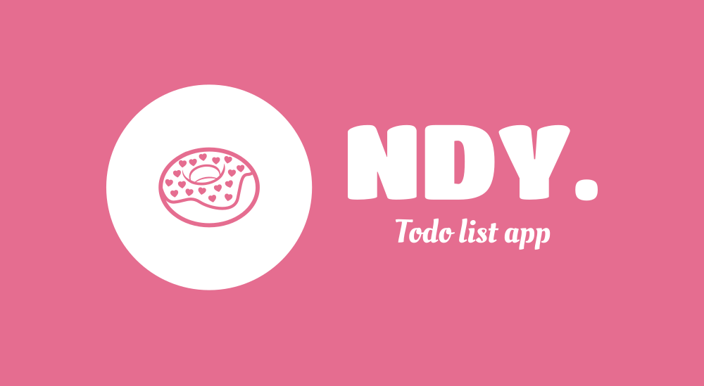

<h1 align="center">NutDoneYet-CLI</h1>

  </img>

    

<h3 align="center">A Python-based To-Do List application featuring natural language support for effortless task management.</h3>

NutDoneYet-CLI is a task management tool that allows you to easily manage your to-do list from the command line. It is currently under development and does not have any functionality at the moment.

## Features
NutDoneYet-CLI will include the following features:

* Natural language support for date input
* Labels for categorizing tasks
* Projects for organizing related tasks
* Sub-tasks for breaking down larger tasks into smaller ones

## Getting Started
At the moment, there is no functionality available in NutDoneYet-CLI. Stay tuned for updates as development progresses.

## Contributing
Contributions to NutDoneYet-CLI are welcome! If you'd like to contribute, please submit a pull request.

## License
NutDoneYet-CLI is licensed under the [MIT License](LICENSE).
